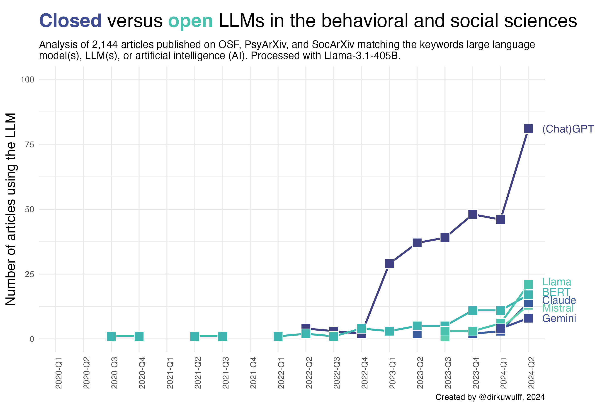

# Usage of LLMs in Behavioral and Social Sciences

by [Dirk U. Wulff](https://www.mpib-berlin.mpg.de/person/93374/2549), [Zak Hussain](https://zak-hussain.github.io/), & [Rui Mata](https://matarui.org/)

This repository accompanies the following <a href="">comment</a> and shares the code to facilitate the monitoring of LLM usage across academic fields. 

```
@misc{wulff_2024_open,
 title={The Behavioral and Social Sciences Need Open LLMs},
 url={},
 DOI={},
 publisher={},
 author={Wulff, Dirk U and Hussain, Zak and Mata, Rui},
 year={2024},
 month={}
}
```

## Monitoring LLM usage in Behavioral and Social Sciences



We analyzed the distribution of LLMs used in the behavioral and social sciences by taking the following steps: 

1. Identify articles on OSF, PsyArXiv, and SocArXiv matching the keywords "LLM", "LLMs", "large language model", "large language models", "AI", and "artificial intelligence" (see [0_get_article_links_*.py](2_code))
2. Download articles and article information (see [1_get_article_info.R](2_code/1_get_article_info.R))
3. Extract the names of LLMs used within articles using Llama-3.1-405B-Instruct (see [2_process_articles.py](2_code/2_process_articles.py))
4. Manually clean LLM names and label them open or closed (see [3_clean.R](2_code/3_clean.R) and [models_clean.csv](1_data/models_clean.csv))
5. Analyze the distribution of open and closed LLMs (see [4_analyze.R](2_code/4_analyze.R))
